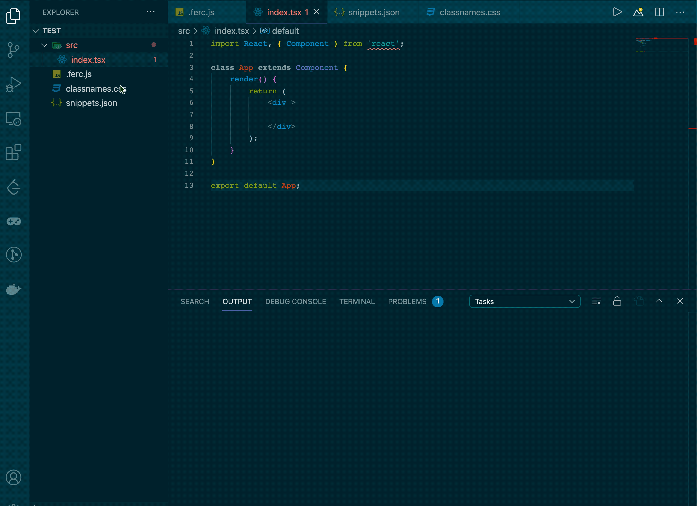

# FEATOMIC

FEATOMIC is a extension for Web Front-end development which can significantly improve development efficiency.(Maybe😂)

## Features



- atmoic className suggestion and customization

- javascript code snippets customization

## Extension Usage

- Open your project, add a `.ferc.js` file to the root.

- add a classNames file `classnames.css` and a snippets file `snippets.json` to the root, such as:

```css
    /* 外边距12px */
    .margin-12{
        margin:12px;
    };

    /* 主题色字体 */
    .font-6{
        color:rgba(0,0,0,0.45);
        font-size: 20px;
        transition: all cubic-bezier(0.075, 0.82, 0.165, 1);
    }
```

```json
{
    "consoleLog": {
        "prefix": "clg",
        "body": "console.log(${1:object});",
        "description": "Displays a message in the console"
    },
    "classNames":{
        "prefix": "cls",
        "body": "className=",
        "description": "Displays a message in the console"
    }
}
```

- Edit the `.ferc.js` file and input the content like this:

```javascript
module.exports = {
    classNames:['./classnames.css'],
    snippets:['./snippets.json']
};
```

- `.ferc.js` also support npm packages.

- start coding with high speed.

## Release Notes

### 1.0.0

Initial release of Featmoic

### For more information

**Enjoy!**
